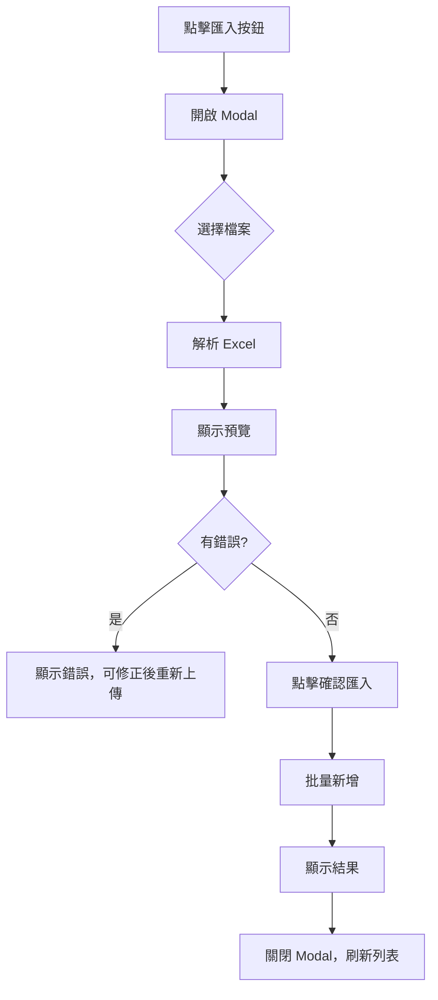

# Product Excel Import - Implementation Plan

為商品庫新增批量 Excel 匯入功能，讓用戶可以快速新增多個商品。

## Excel 範本欄位

| 欄位名稱 | 必填 | 說明 |
|---------|------|------|
| 商品名稱 | ✅ | name |
| 條碼 | ❌ | barcode |
| 售價 | ❌ | price（預設 0） |
| 成本 | ❌ | cost（預設 0） |
| 庫存 | ❌ | stock（預設 0） |
| 分類 | ❌ | category（名稱對應 category_id） |

> 系統自動產生：`item_code`（流水號，如 P00001）

---

## 技術方案

### 依賴套件
```bash
npm install xlsx
```

---

## Proposed Changes

### Phase 1: API Endpoint

#### [NEW] `app/api/products/import/route.ts`
- `POST` - 接收 Excel 檔案，解析並批量新增商品
- 驗證欄位、檢查重複條碼
- 回傳成功/失敗統計

---

### Phase 2: Frontend UI

#### [MODIFY] `app/products/page.tsx`
- 新增「匯入」按鈕（在「新增商品」旁邊）
- 點擊開啟 Import Modal

#### [NEW] `components/ProductImportModal.tsx`
- 檔案選擇（拖放或選擇 .xlsx/.xls）
- 下載範本按鈕
- 預覽解析結果表格（顯示驗證錯誤）
- 確認匯入按鈕
- 匯入結果統計

---

### Phase 3: Excel Template

#### [NEW] `public/templates/product-import-template.xlsx`
- 提供空白範本給用戶下載
- 包含範例資料

---

## UX 流程



---

## 驗證規則

1. **商品名稱** - 必填，不可為空
2. **條碼** - 選填，若有則檢查是否重複
3. **售價/成本/庫存** - 必須為數字，預設 0
4. **分類** - 若填寫，檢查是否存在

---

## 錯誤處理

| 情況 | 處理方式 |
|------|---------|
| 檔案格式錯誤 | 提示「請上傳 .xlsx 或 .xls 檔案」 |
| 條碼重複（檔案內） | 標記該列錯誤 |
| 條碼已存在（資料庫） | 標記該列錯誤 |
| 分類不存在 | 標記警告，留空 |
| 部分失敗 | 顯示「成功 X 筆，失敗 Y 筆」 |

---

## Verification Plan

1. 下載範本 → 填入資料 → 上傳
2. 驗證預覽正確顯示
3. 確認匯入 → 檢查商品列表
4. 測試錯誤情境（重複條碼、空名稱）
