# Purchase Excel Import - Implementation Plan

批量匯入進貨紀錄功能，讓用戶可以快速匯入多筆進貨資料。

---

## Excel 範本欄位

| 欄位名稱     | 必填 | 說明                                            |
|-------------|------|------------------------------------------------|
| 訂單編號     | ✅   | 用於分組，相同編號的行會合併為一筆進貨單          |
| 供應商代碼/名稱 | ✅   | 對應 `vendor_code` 或從名稱轉換                 |
| 進貨日期     | ❌   | 格式 `YYYY-MM-DD`，預設為匯入當天               |
| 是否已付款   | ❌   | `是`/`否`，預設 `否`（未付則產生應付帳款）       |
| 商品條碼     | ✅   | 對應商品 `barcode`，用於查找 `product_id`       |
| 數量         | ✅   | 進貨數量，必須為正整數                          |
| 單位成本     | ✅   | 每單位的進貨成本                                |
| 備註         | ❌   | 訂單備註                                        |

> **系統自動產生**：`purchase_no`（進貨單號，如 P0001）

### 範例資料

| 訂單編號  | 供應商代碼 | 進貨日期    | 是否已付款 | 商品條碼        | 數量 | 單位成本 | 備註     |
|----------|-----------|------------|-----------|----------------|------|----------|----------|
| PO-001   | V001      | 2026-01-15 | 否         | 4710088012345  | 10   | 100      | 首批進貨 |
| PO-001   | V001      | 2026-01-15 | 否         | 4710088012346  | 5    | 150      |          |
| PO-002   | V002      | 2026-01-16 | 是         | 4710088012345  | 20   | 95       |          |

> 上例會產生 2 筆進貨單（PO-001 → 2 個品項，PO-002 → 1 個品項）

---

## 技術方案

### 依賴套件
```bash
npm install xlsx  # 已安裝
```

---

## Proposed Changes

### Phase 1: API Endpoint

#### [NEW] `app/api/purchases/import/route.ts`

建立進貨匯入 API：

- `POST` - 接收 Excel 檔案，解析並批量新增進貨單
- 支援 `preview=true` 參數做預覽驗證
- 驗證邏輯：
  - 供應商代碼/名稱存在性檢查
  - 商品條碼存在性檢查（條碼或品號）
  - 數量必須為正整數
  - 成本必須為正數
- 回傳成功/失敗統計

**核心邏輯**：
1. 解析 Excel 標題列，對應欄位名稱
2. 按「訂單編號」分組各行資料
3. 驗證每筆訂單的供應商、商品
4. 建立進貨單（直接設為 approved 狀態）
5. 若未付款，建立 AP 應付帳款記錄
6. 回傳匯入結果統計

---

### Phase 2: Frontend UI

#### [MODIFY] `app/purchases/page.tsx`

- 在頁面標題旁新增「📥 匯入」按鈕
- 點擊開啟 `PurchaseImportModal`

#### [NEW] `components/PurchaseImportModal.tsx`

參照 `ProductImportModal` 設計：

- 拖放或選擇 Excel 檔案
- 下載匯入範本按鈕
- 預覽解析結果（按訂單分組顯示）
- 顯示驗證錯誤與警告
- 確認匯入按鈕
- 匯入完成統計

---

## UX 流程

```mermaid
graph TD
    A[點擊匯入按鈕] --> B[開啟 Modal]
    B --> C{選擇檔案}
    C --> D[解析 Excel]
    D --> E[顯示預覽 - 按訂單分組]
    E --> F{有錯誤?}
    F -->|是| G[顯示錯誤，可修正後重新上傳]
    F -->|否| H[點擊確認匯入]
    H --> I[批量建立進貨單]
    I --> J[顯示結果統計]
    J --> K[關閉 Modal，刷新列表]
```



---

## 驗證規則

1. **訂單編號** - 必填，用於分組
2. **供應商代碼/名稱** - 必填，檢查是否存在
3. **商品條碼** - 必填，若 barcode 查無商品，用 item_code 再次查找
4. **數量** - 必須為正整數
5. **單位成本** - 必須為數字，≥ 0
6. **進貨日期** - 若填寫，必須為有效日期格式

---

## 錯誤處理

| 情況               | 處理方式                      |
|--------------------|------------------------------|
| 檔案格式錯誤        | 提示「請上傳 .xlsx 或 .xls 檔案」|
| 缺少必填欄位        | 標記該列錯誤                   |
| 供應商不存在        | 標記該列錯誤                   |
| 商品條碼不存在      | 標記該列錯誤                   |
| 數量不合法          | 標記該列錯誤                   |
| 成本不合法          | 標記該列錯誤                   |
| 部分失敗            | 顯示「成功 X 筆，失敗 Y 筆」    |

---

## 匯入行為說明

1. **訂單編號分組**：相同訂單編號的所有行會合併為一筆進貨單
2. **取訂單主資料**：供應商、日期、備註等從該訂單的**第一行**取得
3. **狀態設定**：匯入的進貨單直接設為 `approved` 狀態（等待收貨）
4. **庫存處理**：庫存在「收貨」時才會增加，匯入時不影響庫存
5. **應付帳款**：若未付款，自動建立 AP 記錄

---

## Verification Plan

### Manual Verification

由於此為新增功能，需要手動測試：

1. **下載範本測試**
   - 點擊「📥 匯入」按鈕
   - 下載匯入範本
   - 確認範本欄位正確

2. **預覽功能測試**
   - 填入範例資料（包含有效和無效資料）
   - 上傳檔案
   - 確認預覽正確顯示、錯誤/警告標示正確

3. **匯入功能測試**
   - 使用有效資料匯入
   - 確認進貨記錄正確建立
   - 確認應付帳款正確建立（若未付款）

4. **錯誤情境測試**
   - 供應商不存在
   - 商品條碼不存在
   - 數量為負數或非數字

---

## 備註

- 此功能參照現有 `ProductImportModal` 設計模式
- 使用 `xlsx` 套件解析 Excel（已安裝）
- 進貨建立邏輯複用現有 `/api/purchases` POST 程式碼
