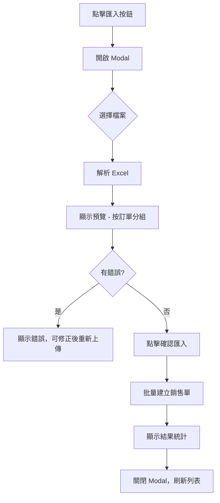

# Sales Excel Import - Implementation Plan

批量匯入銷貨紀錄功能，讓用戶可以快速匯入多筆銷貨資料。

## User Review Required

> [!IMPORTANT]
> **匯入方式選擇**：本設計採用「一筆銷貨 = 一個客戶 + 多個商品」的結構。  
> Excel 中每行為一個銷售明細，系統會自動將相同訂單號的明細歸類為同一筆銷售。
> 
> 請確認：
> 1. 是否需要支援「不同客戶」的批量匯入？（目前一個 Excel 可包含多個客戶的銷售）
> 2. 是否需要自動建立不存在的商品？（目前遇到不存在的商品會報錯）

---

## Excel 範本欄位

| 欄位名稱     | 必填 | 說明                                            |
|-------------|------|------------------------------------------------|
| 訂單編號     | ✅   | 用於分組，相同編號的行會合併為一筆銷售           |
| 客戶代碼or 客戶名稱    | ❌   | 對應 `customer_code`或自己轉換，空白為散客               |
| 銷售日期     | ❌   | 格式 `YYYY-MM-DD`，預設為匯入當天               |
| 來源         | ❌   | `pos`/`live`/`manual`，預設 `manual`           |
| 付款方式     | ❌   | 帳戶名稱，預設 `pending`（待收款）              |
| 是否已付款   | ❌   | `是`/`否`，預設 `否`                            |
| 商品條碼     | ✅   | 對應商品 `barcode`，用於查找 `product_id`       |
| 數量         | ✅   | 銷售數量，必須為正整數                          |
| 售價         | ❌   | 單價，預設使用商品的定價                        |
| 備註         | ❌   | 訂單備註                                        |

> **系統自動產生**：`sale_no`（銷售單號，如 S00001）

### 範例資料

| 訂單編號  | 客戶代碼  | 銷售日期    | 來源   | 付款方式 | 是否已付款 | 商品條碼        | 數量 | 售價 | 備註     |
|----------|----------|------------|--------|---------|-----------|----------------|------|------|----------|
| ORD-001  | C001     | 2026-01-15 | live   | 現金     | 是         | 4710088012345  | 2    | 199  | 直播訂單 |
| ORD-001  | C001     | 2026-01-15 | live   | 現金     | 是         | 4710088012346  | 1    | 299  |          |
| ORD-002  |          | 2026-01-16 | pos    | pending | 否         | 4710088012345  | 3    | 199  |          |

> 上例會產生 2 筆銷售單（ORD-001 → 2 個品項，ORD-002 → 1 個品項）

---

## 技術方案

### 依賴套件
```bash
npm install xlsx  # 已安裝
```

---

## Proposed Changes

### Phase 1: API Endpoint

#### [NEW] `app/api/sales/import/route.ts`

建立銷貨匯入 API：

- `POST` - 接收 Excel 檔案，解析並批量新增銷售單
- 支援 `preview=true` 參數做預覽驗證
- 驗證邏輯：
  - 客戶代碼存在性檢查
  - 商品條碼存在性檢查
  - 數量必須為正整數
  - 帳戶名稱存在性檢查（若指定付款方式）
- 回傳成功/失敗統計

**核心邏輯**：
1. 解析 Excel 標題列，對應欄位名稱
2. 按「訂單編號」分組各行資料
3. 驗證每筆訂單的客戶、商品、帳戶
4. 使用現有 `/api/sales` POST 邏輯建立銷售
5. 回傳匯入結果統計

---

### Phase 2: Frontend UI

#### [MODIFY] `app/sales/page.tsx`

- 在頁面標題旁新增「📥 匯入」按鈕
- 點擊開啟 `SalesImportModal`

#### [NEW] `components/SalesImportModal.tsx`

參照 `ProductImportModal` 設計：

- 拖放或選擇 Excel 檔案
- 下載匯入範本按鈕
- 預覽解析結果（按訂單分組顯示）
- 顯示驗證錯誤與警告
- 確認匯入按鈕
- 匯入完成統計

---

## UX 流程



---

## 驗證規則

1. **訂單編號** - 必填，用於分組
2. **客戶代碼** - 選填，若填寫則檢查是否存在
3. **商品條碼** - 必填，若 barcode 查無商品，用 item_code 再次查找
4. **數量** - 必須為正整數
5. **售價** - 必須為數字，≥ 0
6. **付款方式** - 若填寫，檢查帳戶是否存在
7. **銷售日期** - 若填寫，必須為有效日期格式

---

## 錯誤處理

| 情況               | 處理方式                      |
|--------------------|------------------------------|
| 檔案格式錯誤        | 提示「請上傳 .xlsx 或 .xls 檔案」|
| 缺少必填欄位        | 標記該列錯誤                   |
| 客戶代碼不存在      | 標記該列錯誤                   |
| 商品條碼不存在      | 標記該列錯誤                   |
| 帳戶不存在          | 標記警告，改用 `pending`       |
| 數量不合法          | 標記該列錯誤                   |
| 部分失敗            | 顯示「成功 X 筆，失敗 Y 筆」    |

---

## 匯入行為說明

1. **訂單編號分組**：相同訂單編號的所有行會合併為一筆銷售單
2. **取訂單主資料**：客戶、日期、來源、付款方式、備註等從該訂單的**第一行**取得
3. **直接出貨**：匯入的銷售預設為「已出貨」狀態（`is_delivered = true`）
4. **庫存處理**：由資料庫 trigger 自動扣減庫存
5. **應收帳款**：若未付款、有客戶，自動建立 AR 記錄

---

## Verification Plan

### Manual Verification

由於此為新增功能，需要手動測試：

1. **下載範本測試**
   - 點擊「📥 匯入」按鈕
   - 下載匯入範本
   - 確認範本欄位正確

2. **預覽功能測試**
   - 填入範例資料（包含有效和無效資料）
   - 上傳檔案
   - 確認預覽正確顯示、錯誤/警告標示正確

3. **匯入功能測試**
   - 使用有效資料匯入
   - 確認銷售記錄正確建立
   - 確認庫存正確扣減
   - 確認應收帳款正確建立（若未付款）

4. **錯誤情境測試**
   - 客戶代碼不存在
   - 商品條碼不存在
   - 數量為負數或非數字

---

## 備註

- 此功能參照現有 `ProductImportModal` 設計模式
- 使用 `xlsx` 套件解析 Excel（已安裝）
- 銷售建立邏輯複用現有 `/api/sales` POST 程式碼
